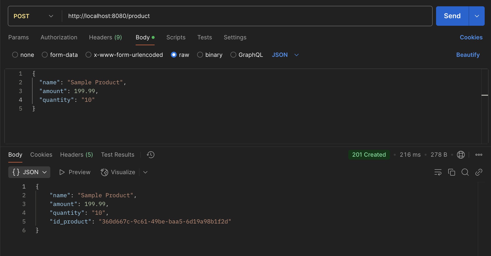
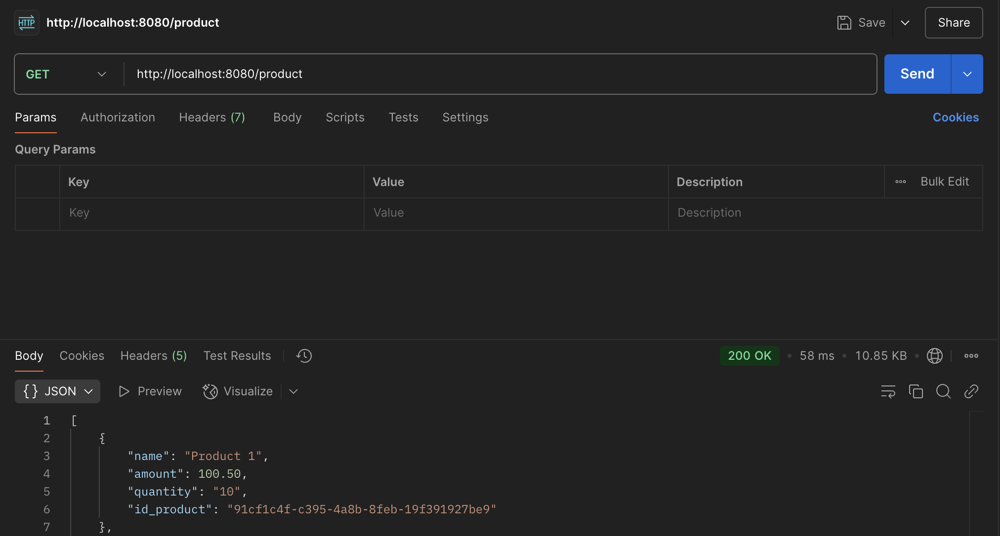
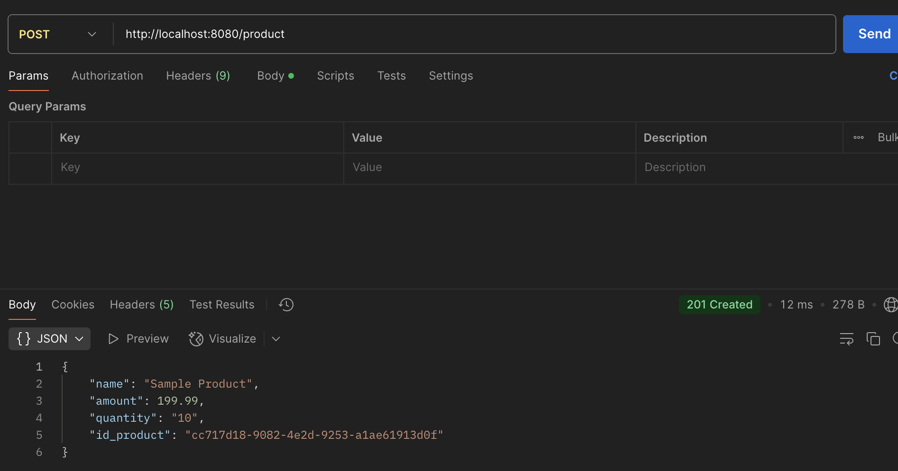

<h1 align='center'>Contoh Implementasi Redis Cache di Spring Boot</h1>

## Teknologi Yang di Gunakan
- Java 21
- Spring Boot
- Redis
- JPA
- Postgresql
- Lombok

## Application Properties
Untuk menjalankan code ini, anda harus menggunakan postgres sebagai database penyimpanan data product. 
Jadi pastika postres sql anda aktif dan buat database terlebih dahulu sebelum menjalankan code. 
dan jangan lupa untuk mengganti koneksi database di application.properties

`spring.datasource.url=jdbc:mysql://localhost:{yourport}/{tablename}`

`spring.datasource.username=username`

`spring.datasource.password=password`

kemudian jangan lupa untuk insert data produk yang telah saya siapkan di folder
`resources/sql/insert_data.sql`

## Branching
- [no-cache](https://github.com/geetoor-maven/redis-spring-boot/tree/no-cache) : branch yang tidak mengimlementasikan redis cache
- [with-cache](https://github.com/geetoor-maven/redis-spring-boot/tree/with-cache) : branch yang sudah mengimplementasikan redis cache

### Waktu Response Jika Tidak Menggunakan Redis Cache
Berikut adalah waktu response ketika saya melakukan request jika tidak menggunakan redis cache

- Mengambil data product

Terlihat waktu pengambilan data selama 219 ms ( gimana kalau code nya udah kompleks ? akan lama lagi pastinya 🧐)

- Membuat data product

Terlihat waktu pembuatan data selama 216 ms ( gimana kalau ada banyak pengecekan ? akan lama lagi pastinya 🧐)

### Waktu Response Jika Menggunakan Redis Cache
Berikut adalah waktu response ketika saya melakukan request jika menggunakan redis cache

- Mengambil data product

Terlihat waktu pemgambilan data selama 58 ms ( sangat jauh jika kita mengimplementasikan cache ya )

- Membuat data product
  
Dari waktu response 216 ms, turun ke 12 ms. 

Btw untuk keseluruhan penjelasannya bisa di baca di artikel saya ya.
[CodeDadakan](https://www.codedadakan.com/2025/03/perbandingan-performa-redis-cache-spring-boot.html)

#### Authors Code
- [@aguskurniawan](https://www.facebook.com/gozhort)

Jika ada pertanyaan, mari diskusikan di telegram : `@geetoor`

`bagikan jika ini bermanfaat`