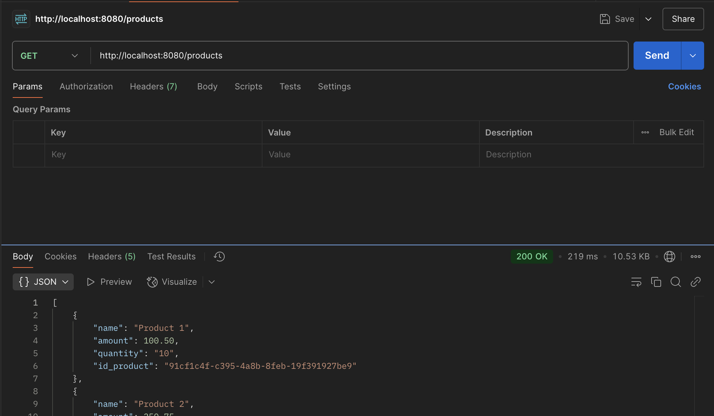

<h1 align='center'>Contoh Implementasi Redis Cache di Spring Boot</h1>

## Teknologi Yang di Gunakan
- Java 21
- Spring Boot
- Redis
- JPA
- Postgresql
- Lombok

## Application Properties
Untuk menjalankan code ini, anda harus menggunakan postgres sebagai database penyimpanan data product. 
Jadi pastika postres sql anda aktif dan buat database terlebih dahulu sebelum menjalankan code. 
dan jangan lupa untuk mengganti koneksi database di application.properties

`spring.datasource.url=jdbc:mysql://localhost:{yourport}/{tablename}`

`spring.datasource.username=username`

`spring.datasource.password=password`

kemudian jangan lupa untuk insert data produk yang telah saya siapkan di folder
`resources/sql/insert_data.sql`

## Branching
- no-cache : branch yang tidak mengimlementasikan redis cache
- with-cache : branch yang sudah mengimplementasikan redis cache

### Waktu Response Jika Tidak Menggunakan Redis Cache
Berikut adalah waktu response ketika saya melakukan request jika tidak menggunakan redis cache

terlihat waktu response 219 ms

### Waktu Response Jika Menggunakan Redis Cache
Berikut adalah waktu response ketika saya melakukan request jika menggunakan redis cache